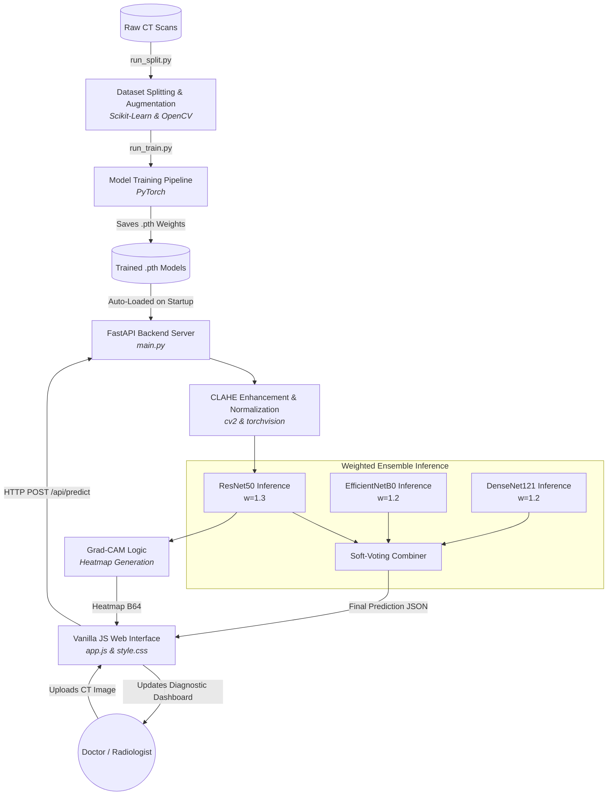

# LungCancerDX - Project Architecture & Technical Overview

## 1. Project Summary
LungCancerDX is a full-stack, AI-powered diagnostic web application designed to classify lung cancer (Benign, Malignant, Normal) from CT scan images. It bridges deep learning architectures with a modern, responsive web application for real-time medical analysis.

## 2. Technology Stack
* **Frontend:** Vanilla JavaScript (ES6+), modern CSS3, HTML5 (NO bulky frameworks like React or Angular, ensuring maximum performance and zero dependency overhead).
* **Backend:** Python 3.9+, FastAPI (for high-performance asynchronous API endpoints), Uvicorn (ASGI server).
* **Machine Learning & Vision:** PyTorch (for Deep Learning model creation and inference), OpenCV (`cv2`) for image manipulation, Scikit-Learn (for dataset splitting and evaluation metrics).
* **Explainable AI (XAI):** Grad-CAM visualization for anatomical region relevance.

---

## 3. High-Level Architecture Diagram
The flowchart below illustrates how data moves through the application, from processing the raw CT images to generating real-time predictions on the web interface.

---

## 4. Key Technical Components

### A. The Data Pipeline (`ml/preprocessing.py` & `scripts/run_split.py`)
To prevent data leakage, the codebase uses **Scikit-Learn** (`train_test_split`) to instantly distribute the original raw dataset cleanly into Train (80%), Validation (10%), and Test (10%) folders.
Because deep learning requires immense amounts of data to not overfit, the training dataset goes through mathematically deterministic **Offline Augmentation**. Using OpenCV, each training image is duplicated via horizontal flips, slight rotations, zooming, and brightness adjustments. This multiplies the dataset size so the neural networks have more robust examples to learn from.

### B. Preprocessing & Enhancement (`CLAHE`)
Medical imagery is extremely subtle. Before any image is sent to the neural network for training or prediction, it is fed through **CLAHE (Contrast Limited Adaptive Histogram Equalization)**. This algorithm maps the pixel intensities over localized areas (rather than the entire image at once), which mathematically forces the hidden edges of subtle lung nodules and cancerous masses to become highly defined.

### C. Artificial Intelligence Engine (`ml/models.py` & `ml/train.py`)
The system utilizes a modern model factory that adapts pre-trained ImageNet architectures for medical classification. It currently supports 5 architectures: **ResNet50, EfficientNetB0, DenseNet121, MobileNetV3, and VGG16**.
Each model is modified with a custom **Dropout layer** (0.4) to reduce overfitting and a **Linear projection** layer tuned for the 3 diagnostic classes: *Benign, Malignant, Normal*.

### D. The Soft-Voting Ensemble Architecture (`backend/main.py`)
The system employs a **Weighted Soft-Voting** system to maximize diagnostic accuracy:
1. When a CT scan hits the `/api/predict` endpoint, FastAPI feeds the image into **all** loaded models (ResNet50, EfficientNetB0, and DenseNet121 based on current checkpoints).
2. The system multiplies each model's independent probability array by a statically assigned weight (e.g., **1.3** for ResNet50, **1.2** for EfficientNet/DenseNet).
3. The system sums these weighted predictions and normalizes them, synthesizing a final diagnosis that is more robust than any single model's output.

### E. Explainable AI: Grad-CAM (`backend/main.py`)
To ensure clinical trust, the system implements **Grad-CAM (Gradient-weighted Class Activation Mapping)** for the ResNet50 model. This computes the gradients of the target class score with respect to the final convolutional layer's feature maps. The result is a **Heatmap Overlay** that highlights the specific anatomical region the AI used to make its decision, allowing doctors to verify the focal point of the malignancy.

### F. Client-Side Rendering (`frontend/app.js`)
The UI is a high-performance "SPA-Lite" built with Vanilla JS. It features:
* **Dynamic Health Monitoring:** Real-time status checks for the FastAPI backend.
* **Stat Count-up Animations:** Visualizing dataset scale (1K+ images).
* **Interactive Breakdown:** A detailed per-model voting display showing exactly how each neural network "voted" in the ensemble.
* **Risk Gauges:** Color-coded confidence markers (Green/Yellow/Red) derived from the raw softmax probabilities.
