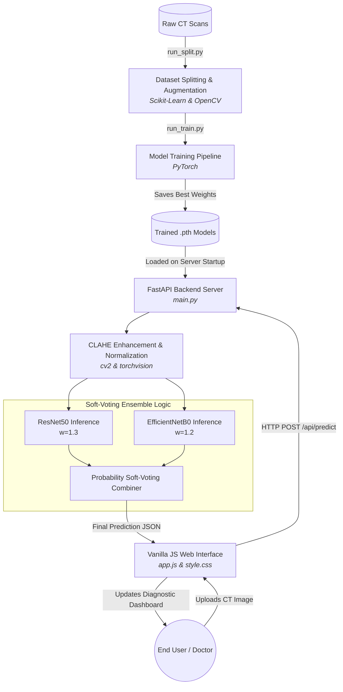

# LungCancerDX - Project Architecture & Technical Overview

## 1. Project Summary
LungCancerDX is a full-stack, AI-powered diagnostic web application designed to classify lung cancer (Benign, Malignant, Normal) from CT scan images. It bridges deep learning architectures with a modern, responsive web application for real-time medical analysis.

## 2. Technology Stack
* **Frontend:** Vanilla JavaScript (ES6+), modern CSS3, HTML5 (NO bulky frameworks like React or Angular, ensuring maximum performance and zero dependency overhead).
* **Backend:** Python 3.9+, FastAPI (for high-performance asynchronous API endpoints), Uvicorn (ASGI server).
* **Machine Learning & Vision:** PyTorch (for Deep Learning model creation and inference), OpenCV (`cv2`) for image manipulation, Scikit-Learn (for dataset splitting and evaluation metrics).

---

## 3. High-Level Architecture Diagram
The flowchart below illustrates how data moves through the application, from processing the raw CT images to generating real-time predictions on the web interface.

---

## 4. Key Technical Components

### A. The Data Pipeline (`ml/preprocessing.py` & `scripts/run_split.py`)
To prevent data leakage, the codebase uses **Scikit-Learn** (`train_test_split`) to instantly distribute the original raw dataset cleanly into Train (80%), Validation (10%), and Test (10%) folders.
Because deep learning requires immense amounts of data to not overfit, the training dataset goes through mathematically deterministic **Offline Augmentation**. Using OpenCV, each training image is duplicated via horizontal flips, slight rotations, zooming, and brightness adjustments. This multiplies the dataset size so the neural networks have more robust examples to learn from.

### B. Preprocessing & Enhancement (`CLAHE`)
Medical imagery is extremely subtle. Before any image is sent to the neural network for training or prediction, it is fed through **CLAHE (Contrast Limited Adaptive Histogram Equalization)**. This algorithm maps the pixel intensities over localized areas (rather than the entire image at once), which mathematically forces the hidden edges of subtle lung nodules and cancerous masses to become highly defined.

### C. Artificial Intelligence Engine (`ml/models.py` & `ml/train.py`)
The system strips the final layers of pre-trained, heavy-weight ImageNet networks from PyTorch (such as **ResNet50** and **EfficientNetB0**). It applies a customized **Dropout layer** (to stop over-reliance on single neurons) and a final custom **Linear projection** layer to force the network to output strictly 3 probabilities: *Benign, Malignant, Normal*.
The training runs automatically utilizing early-stopping, Cosine Annealing Learning Rate scheduling, and generates comprehensive statistical reports including Confusion Matrices and ROC Curves for formal academic defense.

### D. The Soft-Voting Ensemble Architecture (`backend/main.py`)
The most significant engineering feature of the backend is the **Weighted Soft-Voting** system. 
1. When a CT scan hits the `/api/predict` endpoint, FastAPI feeds the tensor into **all** loaded models asynchronously.
2. The models generate their own independent probability arrays (e.g. ResNet50 determines an 85% chance of Malignancy, while EfficientNetB0 estimates 70%).
3. The system multiplies each model's prediction by a statically assigned "Ensemble Weight". Deeper, more historically accurate models like ResNet50 possess a higher mathematical "voting power" than lighter models.
4. The system automatically sums all the weighted predictions and divides them by the total sum of weights, generating a perfectly smoothed, synthesized final diagnosis that mitigates the risk of any single model hallucinating an incorrect detail.

### E. Client-Side Rendering (`frontend/app.js`)
The incredibly lightweight UI eliminates standard bloated React hooks. Images drop cleanly into HTML5 standard Drag & Drop zones. Native JavaScript `fetch()` guarantees that uploading the scan and receiving the analytical diagnosis is seamless, while modern CSS3 flexboxes beautifully populate interactive risk gauges and confidence scorebars based on the JSON response from the FastAPI server.
